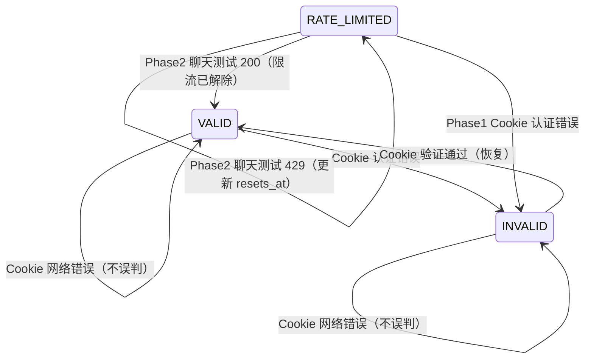

# 多账户管理增强

> 分支：`feat/account-management-enhance`
> 涵盖 5 个功能块，从后端基础设施到前端完整 UI。

## 概览

| # | 功能块 | 提交 | 范围 |
|---|--------|------|------|
| 1 | 后端基础设施重构 | `9f9266c` refactor(account): 增强 AccountManager 基础设施 | 后端 |
| 2 | 仪表盘增强 | `8e765e3` feat(account): 仪表盘账户总数卡片展示状态明细 | 前端 |
| 3 | 账户列表增强 | `2565e36` feat(account): 账户列表增强 - 搜索筛选、排序、分页与批量操作 | 前后端 |
| 4 | 批量添加 Cookie | `6b98aaf` feat(account): 批量添加 Cookie 支持并发处理 | 前端 |
| 5 | 账户状态刷新 | `d444f41` feat(account): 刷新账户状态 - 凭证验证、限流探测与批量操作UI | 前后端 |

---

## 1. 后端基础设施重构

> `app/services/account.py`

为后续批量操作打基础，解决三个现存问题：

### 1.1 原子写入

`save_accounts()` 改为"临时文件 + `os.replace`"模式，避免进程崩溃时损坏 `accounts.json`。

### 1.2 并发锁

新增 `self._write_lock = asyncio.Lock()`，所有写操作（添加/删除/状态更新）在锁内执行。

### 1.3 内存删除与持久化解耦

新增 `_remove_account_from_memory()` 仅做内存操作，批量删除场景只落盘一次：

```
remove_account()       → _remove_account_from_memory() + save_accounts()  （单删，保持原行为）
batch_remove_accounts() → N × _remove_account_from_memory() + 1 × save_accounts()  （批量，单次落盘）
```

---

## 2. 仪表盘增强

> `front/src/pages/Dashboard.tsx`

账户总数卡片右下角新增状态明细：

```
┌─ 账户总数 ──────────────────────────────┐
│  195                ●180  ●12  ●3      │
│                     正常  限流  无效     │
└─────────────────────────────────────────┘
```

复用后端 `AccountStats` 中已有的 `valid_accounts` / `rate_limited_accounts` / `invalid_accounts` 字段。

---

## 3. 账户列表增强

### 数据流管线

```
accounts (API 全量)
    ↓ 筛选 (searchQuery + statusFilter + authTypeFilter + accountTypeFilter)
    ↓ = filteredAccounts (useMemo)
    ↓ 排序 (sortField + sortDirection)
    ↓ = sortedAccounts (useMemo)
    ↓ 分页 (page + pageSize → slice)
    ↓ = paginatedAccounts (useMemo)
```

核心逻辑封装在 `front/src/hooks/use-account-list.ts`（`useAccountList` Hook）。

### 功能清单

| 功能 | 实现 |
|------|------|
| UUID 搜索 | React 19 `useDeferredValue` 防抖 |
| 状态筛选 | 全部 / 正常 / 限流中 / 无效 |
| 认证方式筛选 | 全部 / Cookie / OAuth / Cookie+OAuth |
| 账户类型筛选 | 全部 / Free / Pro / Max |
| 单列排序 | 三态循环 null → asc → desc → null（状态/认证/类型/最后使用/重置时间） |
| 客户端分页 | 10/20/50/100 条/页 |
| 行选择 | Checkbox + 当前页全选（表头）+ 全部全选（筛选栏） |
| 批量删除 | `POST /batch/delete` + AlertDialog 确认 |

### 桌面端布局

```
┌──────────────────────────────────────────────────────────────────┐
│  账户管理                     [OAuth登录] [批量添加] [添加Cookie] │
│                                                                  │
│  搜索UUID... │ 状态▾ │ 认证▾ │ 类型▾ │ ☑全选                   │
│                                                                  │
│  已选 3 项  │  [批量刷新]  │  [批量删除]  │  [取消选择]          │
│                                                                  │
│  ☑│ UUID   │ 认证 │ 状态↕ │ 类型↕ │ 最后使用↕ │ 重置时间↕ │操作│
│  ──────────────────────────────────────────────────────────────  │
│  ☐│abc-1.. │Cookie│ 正常  │ Pro   │ 2/19     │ -        │ ... │
│                                                                  │
│  每页 20▾ 条   第 1-20 项，共 85 项   [< 上页] [下页 >]         │
└──────────────────────────────────────────────────────────────────┘
```

### 移动端适配

- 卡片视图（`MobileAccountCard`）替代表格
- 筛选/排序通过底部 Sheet 交互
- 排序 Sheet：选项列表 + 升序/降序切换按钮（始终渲染，未选时 disabled）

### 前端组件结构

| 组件 | 文件 | 职责 |
|------|------|------|
| `AccountFilters` | `front/src/components/AccountFilters.tsx` | 搜索/筛选/排序（桌面水平栏 + 移动端 Sheet） |
| `AccountSelectionToolbar` | `front/src/components/AccountSelectionToolbar.tsx` | 选中时的批量操作栏 |
| `AccountPagination` | `front/src/components/AccountPagination.tsx` | 分页控件 |
| `useAccountList` | `front/src/hooks/use-account-list.ts` | 筛选/排序/分页/选择 状态管理 |

---

## 4. 批量添加 Cookie

> `front/src/components/BatchCookieModal.tsx`

- Worker Pool 并发处理多个 Cookie
- `useRef` 取消标志，处理中可随时取消
- 弹窗可在处理中关闭（触发取消）
- 支持复制失败的 Cookie

---

## 5. 账户状态刷新

### 状态转换规则



### RATE_LIMITED 两阶段探测

| 阶段 | 操作 | 说明 |
|------|------|------|
| Phase 1 | Cookie 验证 | `get_organization_info(cookie)` — 只读，不消耗配额 |
| Phase 2 | 最小聊天测试 | 仅 Cookie 有效时执行。OAuth: `POST /v1/messages {max_tokens:1}`；Cookie-only: `ClaudeWebClient` 发最小消息后删除会话 |

**为什么只对 RATE_LIMITED 做聊天测试**：VALID/INVALID 通过 Cookie 验证就能确定状态。唯独 RATE_LIMITED 的 Cookie 可能有效但限流未解除，需要真实请求判断。限流账户通常很少，不会造成浪费。

### 后端实现

> `app/services/account.py` + `app/api/routes/accounts.py`

| 方法/端点 | 说明 |
|-----------|------|
| `_probe_rate_limit(account)` | 限流探测，返回 `('valid', None)` / `('rate_limited', resets_at)` / `('error', None)` |
| `refresh_account_status(uuid)` | 单账户刷新：Cookie 验证 → OAuth 刷新 → 限流探测 → 状态更新 |
| `batch_refresh_accounts(uuids, concurrency)` | 批量刷新，`asyncio.Semaphore` 控制并发 |
| `POST /batch/refresh` | 批量刷新端点，请求体 `{organization_uuids, concurrency}` |
| `POST /{uuid}/refresh` | 单账户刷新端点 |

### 前端实现

| 功能 | 位置 |
|------|------|
| 单账户刷新 | `Accounts.tsx` 下拉菜单「刷新」+ 移动端按钮 |
| 刷新中状态显示 | 状态列蓝色 `Loader2` + "刷新中"（桌面 + 移动端） |
| 批量刷新入口 | `AccountSelectionToolbar` 批量刷新按钮 |
| 批量刷新弹窗 | `BatchRefreshModal.tsx` — Worker Pool 并发、取消、进度展示 |
| 弹窗完成后 | 状态明细文案 + 「删除无效账户」按钮 |
| selectedIds 修剪 | `useAccountList` 中 `setAccounts` 自动剔除已删除账户的选中状态 |

---

## 改动文件索引

### 后端

| 文件 | 改动 |
|------|------|
| `app/services/account.py` | 原子写入 + 并发锁 + 内存解耦 + 批量删除 + 刷新逻辑（_probe_rate_limit / refresh_account_status / batch_refresh_accounts） |
| `app/api/routes/accounts.py` | BatchDelete 模型 + 端点；AccountRefreshResult / BatchRefresh 模型 + 端点 |

### 前端

| 文件 | 改动 |
|------|------|
| `front/src/hooks/use-account-list.ts` | **新建** — 筛选/排序/分页/选择 Hook + selectedIds 自动修剪 |
| `front/src/pages/Accounts.tsx` | 重构 — 集成 Hook + 组件 + 单账户刷新 + 刷新中状态显示 |
| `front/src/pages/Dashboard.tsx` | 账户总数卡片状态明细 |
| `front/src/components/AccountFilters.tsx` | **新建** — 搜索/筛选/排序（桌面 + 移动端 Sheet） |
| `front/src/components/AccountSelectionToolbar.tsx` | **新建** — 批量操作栏（刷新 + 删除） |
| `front/src/components/AccountPagination.tsx` | **新建** — 分页控件 |
| `front/src/components/BatchRefreshModal.tsx` | **新建** — 批量刷新弹窗 |
| `front/src/components/BatchCookieModal.tsx` | 并发处理 + 取消机制 |
| `front/src/components/ui/checkbox.tsx` | **新建** — Radix UI Checkbox（视觉增强） |
| `front/src/api/types.ts` | BatchDelete + AccountRefresh 类型 |
| `front/src/api/client.ts` | batchDelete + refreshAccount + batchRefresh 方法 |

---

## API 端点汇总

| 方法 | 端点 | 说明 |
|------|------|------|
| POST | `/api/admin/accounts/batch/delete` | 批量删除账户 |
| POST | `/api/admin/accounts/batch/refresh` | 批量刷新账户状态 |
| POST | `/api/admin/accounts/{uuid}/refresh` | 单账户状态刷新 |
