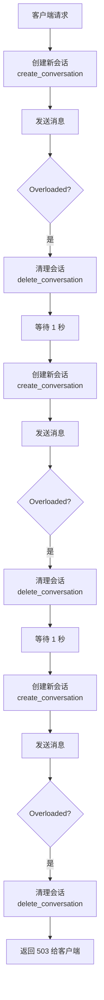

# Overloaded Error (503) 分析报告

> 日期：2026-02-20
> 状态：已分析，暂不修改代码
> 影响模型：claude-sonnet-4-6（claude-4-5-sonnet 未受影响）

## 1. 问题描述

### 现象

生产环境运行 195 个 Cookie 模式账户、229 个活跃会话时，大量请求收到 `overloaded_error` (503) 错误。错误仅出现在 `claude-sonnet-4-6` 模型上，`claude-4-5-sonnet` 模型完全正常。当并发连接数降低后，错误自动消失。

### 错误日志示例

```
Pipeline processing failed: ClaudeStreamingError(
    error_code=503500,
    message_key='processors.nonStreamingResponseProcessor.streamingError',
    status_code=503,
    context={'error_type': 'overloaded_error', 'error_message': 'Overloaded'}
)
```

### 影响

- 流式请求（stream=true）：`overloaded_error` 直接透传给客户端，**无重试机会**
- 非流式请求：触发重试（最多 3 次，间隔 1 秒），但重试基本都失败
- 每次重试都创建新会话 + 发消息 + 删除会话，加重了 Anthropic 后端压力

---

## 2. 日志分析

### 数据统计（来源：`tmp/app.log`，1683 行）

| 指标 | 数值 |
|------|------|
| Overloaded 错误事件 | **427 次** |
| OAuth API 请求 | **0 次**（全部走 Web 路径） |
| 会话创建/删除 | **752 次** |
| Tool Call 操作 | 127 次 |
| 流式请求 | 199 次 |
| 非流式请求 | 151 次 |

### 时间线

```
18:19:32  ┌─ Overloaded 风暴开始
          │  几乎所有请求都返回 Overloaded
18:22:56  │  30 秒内清理 32 个过期会话（高峰）
18:23:26  │  30 秒内清理 29 个过期会话
18:24:56  │  30 秒内清理 17 个过期会话
18:26:42  └─ 最后一条 Overloaded 日志
18:27:00+    Overloaded 完全消失
18:30:57     大批量会话清理（残留清理）
18:31:00+    请求恢复正常，无 Overloaded
```

**Overloaded 持续时间：约 7 分钟**（18:19:32 → 18:26:42）

### 会话清理趋势（每 30 秒清理一次）

```
时间       清理数量    说明
18:19:56      1       刚开始
18:20:26      3       错误开始累积
18:22:26     10       ↑ 失败会话激增
18:22:56     32       ← 峰值！大量会话快速创建-失败-清理
18:23:26     29       持续高位
18:23:56     18       开始下降
18:24:26      7       波动
18:24:56     17       再次上升
18:25:26     18       持续
18:25:56      8       开始缓解
18:27:56      2       ← 恢复正常
18:28:56      1       正常
```

---

## 3. 根因分析

### 结论：Anthropic 的 claude-sonnet-4-6 模型全局容量不足

### 证据链

**证据 1：错误来自 Anthropic 服务端**

`overloaded_error` 出现在 Claude.ai 返回的 SSE 流中，是 Anthropic 后端生成的错误事件，不是本项目代码生成的。HTTP 请求本身返回 200 OK，但响应流内容包含：

```json
{"type": "error", "error": {"type": "overloaded_error", "message": "Overloaded"}}
```

**证据 2：不是单账户问题**

- 195 个不同账户都收到 Overloaded → 不是某个账户被针对
- 只有 2 个账户触发了真正的 Rate Limit（429）→ 大多数账户没有达到个人限额
- 重试时代码确实会切换到不同账户（通过负载均衡），但结果不变

**证据 3：是模型级别的问题**

- `claude-sonnet-4-6` 受影响，`claude-4-5-sonnet` 不受影响
- 不同模型在 Anthropic 后端有不同的容量配置
- sonnet-4-6 可能因为更新/更热门，分配的容量不足以支撑 229 并发

**证据 4：并发降低后自动恢复**

- 18:27 之后 Overloaded 完全消失，说明不是持续性故障
- 你观察到"只有几个连接就正常了"——进一步证实是容量问题

**证据 5：不是本项目性能问题**

- 项目是全异步架构（FastAPI + async/await），229 并发没有压力
- 项目只是代理转发，瓶颈在 Claude.ai 服务端

### 排除项

| 假设 | 排除依据 |
|------|---------|
| 代码 bug | 错误字符串来自 Anthropic，不是本项目 |
| 程序并发不足 | 全异步架构，229 并发轻松处理 |
| 重试打同一账号 | 代码逻辑确认每次重试会换号 |
| 单账户限流 | 只有 2 个被 429，427 次 Overloaded 是全局的 |
| Claude 全局故障 | 4.5 模型正常，Status 页面无异常 |

---

## 4. 当前重试机制的问题

### 雪崩效应

当前重试流程在 overloaded 场景下会放大问题：



**每个请求失败 = 向 Anthropic 发送 3 次 create + 3 次 send + 3 次 delete = 9 次请求**

229 个并发 × 9 = **2061 次请求**打向已经过载的后端。

### 流式请求无重试

当 `stream=true`（主要使用模式）时，`overloaded_error` 在 `StreamingResponseProcessor` 创建 `StreamingResponse` 后才从流中读出，此时 HTTP 响应已经开始发送，**无法重试**。错误直接透传给客户端。

### Rate Limit vs Overloaded 处理差异

| 方面 | Rate Limit (429) | Overloaded (SSE error) |
|------|---|---|
| 触发方式 | HTTP 状态码 429 | HTTP 200 + SSE 流中的 error event |
| 账户影响 | 标记 `RATE_LIMITED`，自动恢复 | **无任何标记**（代码未处理） |
| 后台显示 | 显示为限流 | **不显示** |
| 重试行为 | 重试（retryable=true） | 重试（retryable=true），但无差异化 |

---

## 5. 优化方案（留档备用）

> 以下方案暂不实施，记录备用。

### 方案 A：优化重试机制

#### A1. 新增 `ClaudeOverloadedError` 异常

**文件**: `app\core\exceptions.py`

从通用 `ClaudeStreamingError` 中分离出专用的 overloaded 异常，允许差异化处理：

```python
class ClaudeOverloadedError(AppError):
    def __init__(self, error_message: str = "Overloaded", context=None):
        _context = context.copy() if context else {}
        _context.update({"error_type": "overloaded_error", "error_message": error_message})
        super().__init__(
            error_code=503510,
            message_key="processors.overloadedError",
            status_code=503,
            context=_context,
            retryable=True,
        )
```

#### A2. 指数退避替代固定间隔

**文件**: `app\api\routes\claude.py`

当前：固定 1 秒间隔，最多 3 次。改为：

```python
def overload_aware_wait(retry_state):
    """overloaded 用指数退避，其他错误保持固定间隔"""
    exc = retry_state.outcome.exception() if retry_state.outcome else None
    if isinstance(exc, ClaudeOverloadedError):
        return min(2 ** retry_state.attempt_number, 30)  # 2s, 4s, 8s... 上限 30s
    return settings.retry_interval  # 其他错误保持原有固定间隔

def overload_aware_stop(retry_state):
    """overloaded 允许更多重试"""
    exc = retry_state.outcome.exception() if retry_state.outcome else None
    if isinstance(exc, ClaudeOverloadedError):
        return retry_state.attempt_number >= settings.overload_retry_attempts  # 默认 5
    return retry_state.attempt_number >= settings.retry_attempts  # 默认 3
```

#### A3. 流式请求的 Overload 早期检测

**新建文件**: `app\processors\claude_ai\overload_detection_processor.py`

在 `StreamingResponseProcessor` 之前插入处理器，peek 前几个事件。如果是 `overloaded_error` 就拦截并抛异常触发重试（此时 StreamingResponse 尚未创建）：

```python
class OverloadDetectionProcessor(BaseProcessor):
    """在 StreamingResponse 创建前检测 overloaded 错误"""
    MAX_PEEK = 5  # overloaded 通常是第一个事件

    async def process(self, context):
        if not context.event_stream:
            return context
        context.event_stream = self._peek_and_detect(context.event_stream)
        return context

    async def _peek_and_detect(self, stream):
        peeked = []
        async for event in stream:
            peeked.append(event)
            if isinstance(event.root, ErrorEvent):
                if event.root.error.type == "overloaded_error":
                    raise ClaudeOverloadedError(error_message=event.root.error.message)
                break
            if len(peeked) >= self.MAX_PEEK:
                break
        for e in peeked:
            yield e
        async for e in stream:
            yield e
```

Pipeline 中插入位置（`app\processors\claude_ai\pipeline.py`）：

```
 9. MessageCollectorProcessor
10. OverloadDetectionProcessor  ← 新增
11. TokenCounterProcessor
12. StreamingResponseProcessor
13. NonStreamingResponseProcessor
```

#### A4. 账户 Overload 冷却

**文件**: `app\core\account.py`

Account 类添加 `overloaded_until` 字段（不改 AccountStatus 枚举）：

```python
self.overloaded_until: Optional[datetime] = None
```

**文件**: `app\services\account.py` → `get_account_for_oauth()` / `get_account_for_session()`

选号时跳过冷却中的账户：

```python
if account.overloaded_until and datetime.now(UTC) < account.overloaded_until:
    continue
```

> 注意：对于全局 overloaded（如本次事件），换号无效因为是模型级别的问题。但对于偶发的单账户 overloaded 场景仍有价值。

#### A5. 新增配置项

**文件**: `app\core\config.py`

```python
overload_retry_attempts: int = Field(
    default=5, env="OVERLOAD_RETRY_ATTEMPTS",
    description="Maximum retry attempts for overloaded errors",
)
overload_cooldown: int = Field(
    default=30, env="OVERLOAD_COOLDOWN",
    description="Seconds to deprioritize account after overloaded error",
)
```

### 方案 B：并发限流

**位置**: `app\api\routes\claude.py` 或新建 `app\core\rate_limiter.py`

用 `asyncio.Semaphore` 限制到 Claude.ai 的并发请求数：

```python
import asyncio
from app.core.config import settings

# 全局信号量
claude_semaphore = asyncio.Semaphore(settings.max_concurrent_requests)  # 默认 100

@router.post("/messages")
@retry(...)
async def create_message(request, messages_request, _):
    async with claude_semaphore:  # 超出限制的请求在此排队
        context = await ClaudeAIPipeline().process(context)
```

**配置项**:

```python
max_concurrent_requests: int = Field(
    default=100, env="MAX_CONCURRENT_REQUESTS",
    description="Maximum concurrent requests to Claude.ai",
)
```

**效果**: 229 个并发进来 → 只有 100 个同时打 Claude.ai → 其余 129 个排队等待 → 减少后端压力。

---

## 6. 涉及文件清单（如果未来要改）

| 文件 | 操作 | 说明 |
|------|------|------|
| `app\core\exceptions.py` | 修改 | 新增 `ClaudeOverloadedError` |
| `app\core\config.py` | 修改 | 新增 3 个配置项 |
| `app\core\account.py` | 修改 | Account 添加 `overloaded_until` |
| `app\services\account.py` | 修改 | 选号逻辑跳过冷却账户 |
| `app\processors\claude_ai\context.py` | 修改 | 添加 `account` 字段 |
| `app\processors\claude_ai\claude_api_processor.py` | 修改 | 存 account 到 context |
| `app\processors\claude_ai\pipeline.py` | 修改 | 错误处理设冷却 + 注册新处理器 |
| `app\processors\claude_ai\non_streaming_response_processor.py` | 修改 | 区分 overloaded 异常 |
| `app\processors\claude_ai\overload_detection_processor.py` | **新建** | 流式早期检测 |
| `app\processors\claude_ai\__init__.py` | 修改 | 导出新处理器 |
| `app\api\routes\claude.py` | 修改 | 智能重试策略 + 并发限流 |

---

## 7. 关键代码路径参考

### Web 请求完整链路

```
客户端 → /v1/messages (app\api\routes\claude.py:29)
  → @retry 装饰器 (3 次, 1 秒间隔)
  → ClaudeAIPipeline.process() (app\processors\claude_ai\pipeline.py:57)
    → ClaudeAPIProcessor (跳过，无 OAuth token)
    → ClaudeWebProcessor (app\processors\claude_ai\claude_web_processor.py:20)
      → session_manager.get_or_create_session()
        → ClaudeWebSession.initialize() (app\core\claude_session.py:19)
          → account_manager.get_account_for_session() (负载均衡选号)
      → session.send_message()
        → client.create_conversation()  ← HTTP 请求到 Claude.ai
        → client.send_message()         ← HTTP 请求到 Claude.ai (SSE 流)
    → EventParsingProcessor (解析 SSE)
    → MessageCollectorProcessor (收集消息, 记录 ErrorEvent)
    → StreamingResponseProcessor (流式) 或 NonStreamingResponseProcessor (非流式)
      → 发现 ErrorEvent → 抛 ClaudeStreamingError
  → Pipeline 捕获异常 → 清理会话 (delete_conversation)
  → @retry 触发重试 → 新 context → 新会话 → 新账户 → 重复...
```

### 账户选择逻辑

```
get_account_for_session() (app\services\account.py:150)
  → 检查 session_id 是否已绑定账户
  → 如果没有：遍历所有 VALID 账户
    → 过滤 auth_type = BOTH 或 COOKIE_ONLY
    → 跳过会话数达上限的
    → 选择会话数最少的（同数量选最久未用的）
  → 绑定 session_id 到选中账户
```

### 错误处理链路

```
Overloaded 错误:
  SSE 流 → ErrorEvent(type="overloaded_error")
  → MessageCollectorProcessor: WARNING 日志
  → NonStreamingResponseProcessor: 抛 ClaudeStreamingError(retryable=True)
  → Pipeline: 清理会话 + ERROR 日志
  → @retry: 重试（创建新会话新账户）

Rate Limit 错误:
  HTTP 429 → ClaudeRateLimitedError
  → Account.__exit__: 标记 RATE_LIMITED + 设置 resets_at
  → 后台任务 60 秒检查一次，到时间自动恢复 VALID
```
