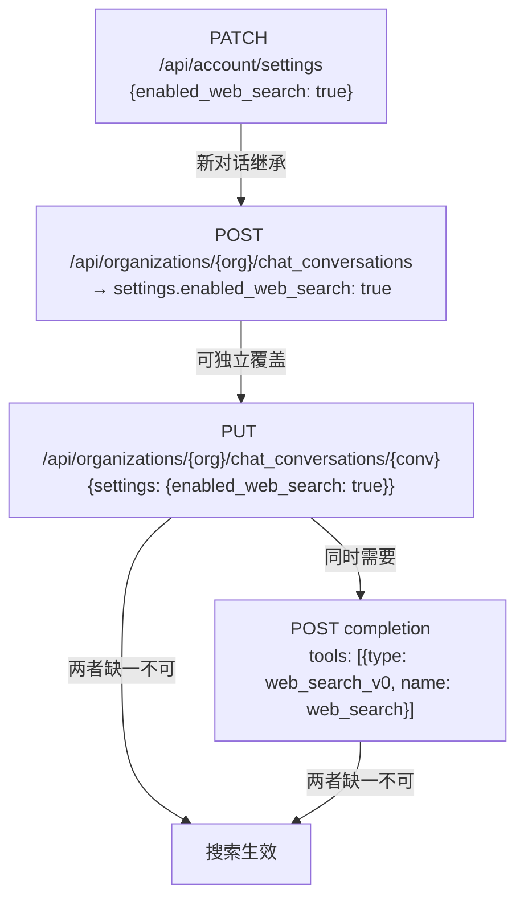

# 网络搜索（Web Search）功能分析

## TL;DR

1. Claude.ai Web 搜索需要 **对话级 `enabled_web_search: true`** + **completion tools 含 `web_search_v0`** 缺一不可
2. Clove Cookie Web 链路：检测客户端 `web_search_20250305` → 替换为 `web_search_v0` + PUT 对话设置
3. Clove OAuth API 链路：`Tool.input_schema` 改为 `Optional`，Server Tool 原样透传
4. 流式输出收敛为 Anthropic 标准事件，私有事件映射/丢弃策略见 [`anthropic-standard-streaming-notes.md`](./anthropic-standard-streaming-notes.md)

---

## Claude.ai 网络搜索机制（实测验证）

### 双重触发条件（2×2 矩阵定论）

网络搜索需要 **对话级设置** + **completion tools 注入** 两者同时满足：

| 对话 `enabled_web_search` | completion tools 含 `web_search_v0` | 搜索结果 |
|:---:|:---:|:---:|
| `null`（未设置） | 有 | **失败** — "My knowledge cutoff is August 2025" |
| `true` | 有 | **成功** — 搜索事件 + 结果返回 |
| `true` | 无 | **失败** — 不触发搜索 |
| `null` / `false` | 无 | **失败** — 不触发搜索 |

**结论**：PUT 对话设置 `enabled_web_search: true` + completion tools 注入 `web_search_v0` = **缺一不可**。

### 两层控制体系



#### 1. 账户级设置（全局默认值）

```
PATCH /api/account/settings
Content-Type: application/json

{"enabled_web_search": true}
```

- 仅支持 `PATCH` 方法（GET 返回 405）
- 响应体为 `null`（无返回内容）
- 修改后，所有**新建对话**继承此值

#### 2. 对话级设置（独立控制）

与 `paprika_mode`（扩展思维）完全一致的工作方式：

```
PUT /api/organizations/{org_uuid}/chat_conversations/{conv_uuid}
Content-Type: application/json

{"settings": {"enabled_web_search": true}}
```

- 仅影响当前对话，不影响账户设置或其他对话
- 响应返回完整的对话对象（含更新后的 settings）

#### 3. Completion 请求 tools 注入（实际触发器）

Claude.ai Web UI 发送的 `/completion` 请求载荷：

```json
{
  "prompt": "最新科技新闻",
  "model": "claude-sonnet-4-6",
  "tools": [
    {"type": "web_search_v0", "name": "web_search"},
    {"type": "artifacts_v0", "name": "artifacts"}
  ],
  "rendering_mode": "messages"
}
```

**关键发现**：对话 settings `enabled_web_search: true` 是前置条件，但 **completion 请求的 tools 数组中包含 `{"type": "web_search_v0", "name": "web_search"}` 才是真正的触发器**。

### 对话级隔离性验证

| 测试场景 | 操作 | 结果 |
|----------|------|------|
| 账户级 ON → 新建对话 | POST create conv | `enabled_web_search: true`（继承账户默认） |
| 对话级覆盖 | PUT conv settings `false` | 该对话变为 `false` |
| 隔离验证 | 再建新对话 | 新对话仍为 `true`，不受其他对话影响 |
| 账户级 OFF → 新建对话 | 创建对话 | `enabled_web_search: null`（非 `false`） |
| 对话级覆盖（反向） | PUT conv settings `true` | 该对话变为 `true`，不影响账户级设置 |

### Tool 类型映射

| 上下文 | Tool 类型 | 来源 |
|--------|-----------|------|
| Claude 官方 API | `web_search_20250305` / `web_search_20260209` | 客户端发送 |
| Claude.ai Web 端 | `web_search_v0` | Web UI 自动注入 |

---

## Claude 官方 API 端搜索机制

OAuth API 端通过 `tools` 数组传入 Server Tool 启用搜索（与 Web 端机制完全不同）：

```json
{
  "model": "claude-sonnet-4-20250514",
  "max_tokens": 1024,
  "messages": [{"role": "user", "content": "今天纽约天气如何？"}],
  "tools": [{
    "type": "web_search_20250305",
    "name": "web_search",
    "max_uses": 5,
    "allowed_domains": ["example.com"],
    "blocked_domains": ["untrusted.com"],
    "user_location": {
      "type": "approximate",
      "city": "San Francisco",
      "region": "California",
      "country": "US",
      "timezone": "America/Los_Angeles"
    }
  }]
}
```

最新版本 `web_search_20260209` 支持动态过滤（需配合 code execution tool），仅 Opus 4.6 和 Sonnet 4.6 可用。

### 搜索响应结构

响应中包含以下特殊内容块：

| 类型 | 说明 |
|------|------|
| `server_tool_use` | Claude 决定执行搜索，包含 `input.query` |
| `web_search_tool_result` | 搜索结果，含 `WebSearchResult[]` |
| `text` (with `citations`) | 带引用的最终回答 |

Usage 中包含 `server_tool_use.web_search_requests` 计数。

---

## Clove 实现

### 设计原则

- **无全局配置**：仅在客户端显式发送 `web_search` tool 时才启用搜索
- **按需启用**：只有检测到 web_search tool 时才调用 `set_web_search(true)` + 注入 `web_search_v0`
- **复用 `paprika_mode` 模式**：Client → Session → Processor 三层一致

### OAuth API 链路

```
客户端 → tools 含 web_search_20250305 → Tool 模型验证通过（input_schema 可选）
→ model_dump_json(exclude_none=True) → tools 原样透传 api.anthropic.com
→ 响应含 server_tool_use + web_search_tool_result（已有模型支持）
```

关键修复：`Tool.input_schema` 从必填改为 `Optional[Any] = None`，Server Tool（无 `input_schema`）不再触发 422 验证错误。

### Cookie Web 链路

```
客户端 → tools 含 web_search_20250305 → Tool 模型验证通过
→ ClaudeWebProcessor._process_web_search_tools():
  1. 移除 web_search_20250305（API 格式）
  2. 注入 web_search_v0（Claude.ai web 格式）
→ session.set_web_search(True) → PUT conversation settings
→ ClaudeWebRequest.tools = [web_search_v0, ...其他工具]
→ Claude.ai completion 端点识别 web_search_v0 → 执行搜索
→ 响应流返回客户端
```

双重保障：
1. **PUT `enabled_web_search: true`** → 对话级设置前置条件
2. **completion tools 含 `web_search_v0`** → 实际触发搜索

### 涉及文件

| 文件 | 修改 |
|------|------|
| `app\models\claude.py` | `Tool.input_schema` 改为 `Optional`，支持 Server Tool |
| `app\core\external\claude_client.py` | 添加 `set_web_search(conv_uuid, enabled)` |
| `app\core\claude_session.py` | 添加代理方法 + `web_search_enabled` 状态追踪 |
| `app\processors\claude_ai\claude_web_processor.py` | 检测/替换 web_search tool + 调用设置 |

### Response 侧模型（已有基础）

`app\models\claude.py` 中已定义搜索结果相关模型：

| 模型 | 用途 |
|------|------|
| `WebSearchResult` | 单条搜索结果（title, url, encrypted_content, page_age） |
| `WebSearchToolResultContent` | 搜索工具结果包装（type="web_search_tool_result"） |
| `ServerToolUseContent` | 服务端工具调用（type="server_tool_use"） |
| `ServerToolUsage` | 用量统计（web_search_requests） |

以上模型已纳入 `ContentBlock` Union，`app\services\cache.py` 也能正确处理。
